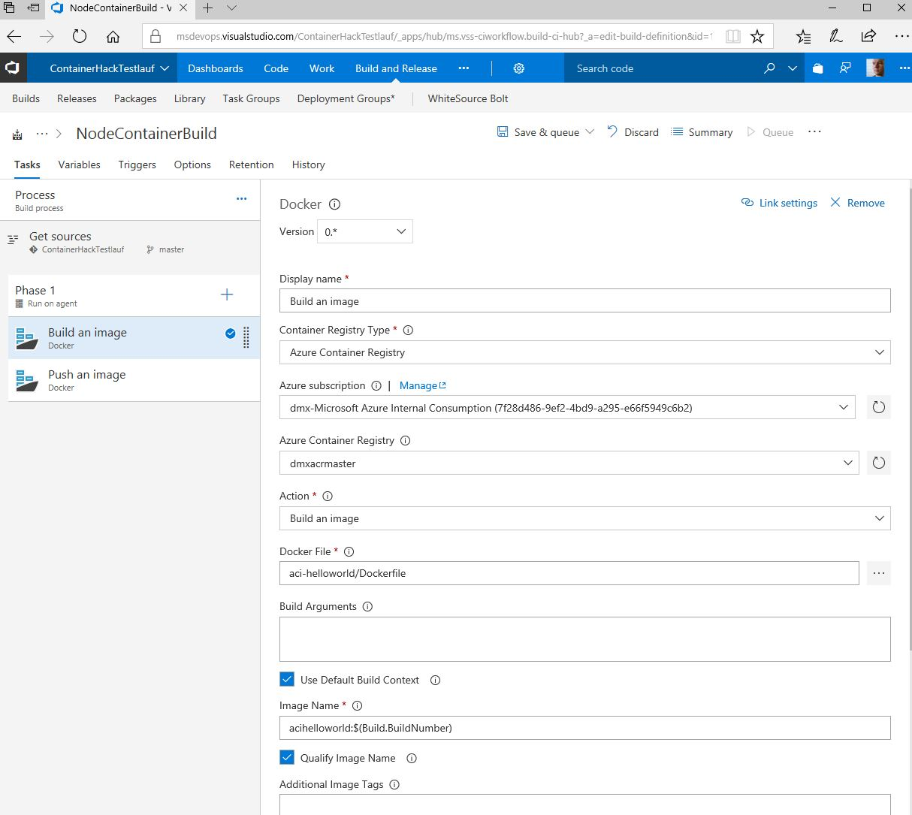

Team Services Configuration to build & push a docker image to your Azure Container Registry

1. [Here](https://docs.microsoft.com/en-us/azure/container-registry/container-registry-get-started-portal) is how you create an Azure Container Registry in the Azure portal if you don't have one yet.

1. Import the sample code from to your VSTS Team Project. You can do this via UI in the Code tab of your Team Project.

1. Create a new build definition you can do this in the Build & Release tab. Choose the submenu "Builds". Create an empty build definition.

1. Choose "Hosted Linux Preview" as build agent queue.

1. Add the following tasks for your build phase (if you don't find them you can search or install from the marketplace)
    - "Docker" task to create a container image
    
    - "Docker" task to push the image
    

1. Later you will need an additional step to move a "*.yaml" file to an artifacts folder. Use the "Publish Build Artifacts" Task. This will look like shown below.

