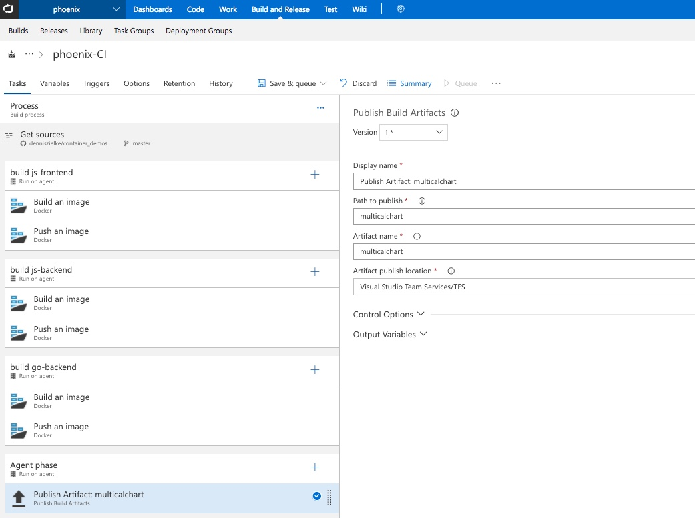
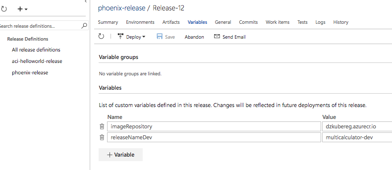
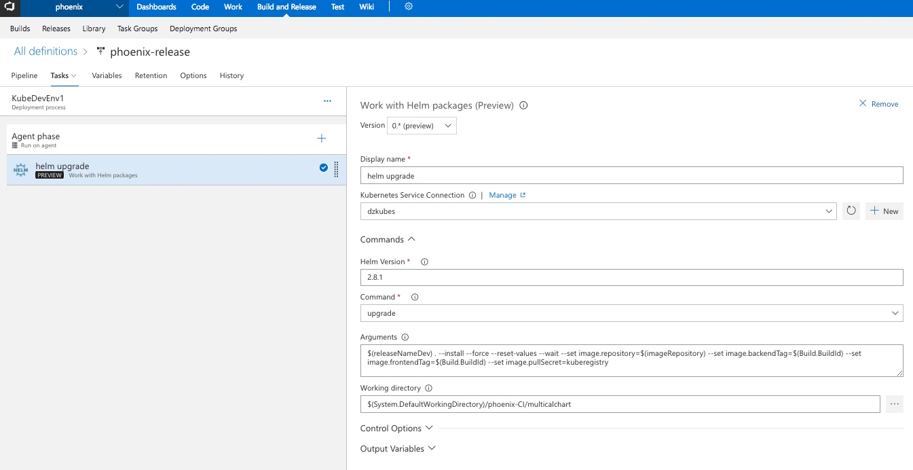

# Team Services to K8s via helm
1. Make sure to drop the helm chart ** multicalculator** to the artifacts in the build definition

2. Create a release pipeline and create a helm release task from here to your vsts https://github.com/debben/vsts-helm-extension
3. Configure the container registry connection information in a process variable

4. Create a kubernetes service connection and create an upgrade command instance.
Ensure that the arguments use the process variables and reference the build id
```
$(releaseNameDev) . --install --force --reset-values --wait --set image.repository=$(imageRepository) --set image.backendTag=$(Build.BuildId) --set image.frontendTag=$(Build.BuildId) --set image.pullSecret=kuberegistry
```

5. Set the working directory to the artifacts path of your helm chart
```
$(System.DefaultWorkingDirectory)/phoenix-CI/multicalculator
```

