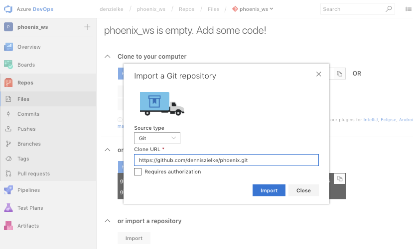
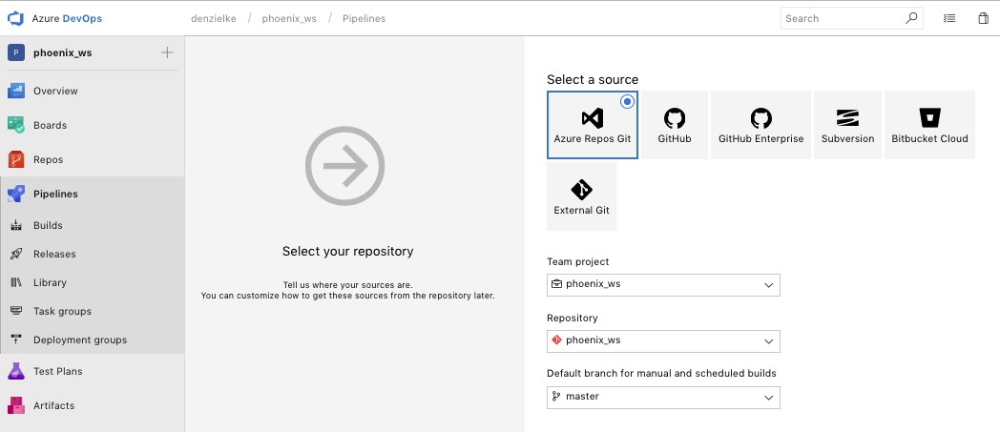
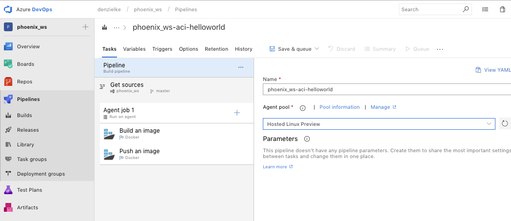
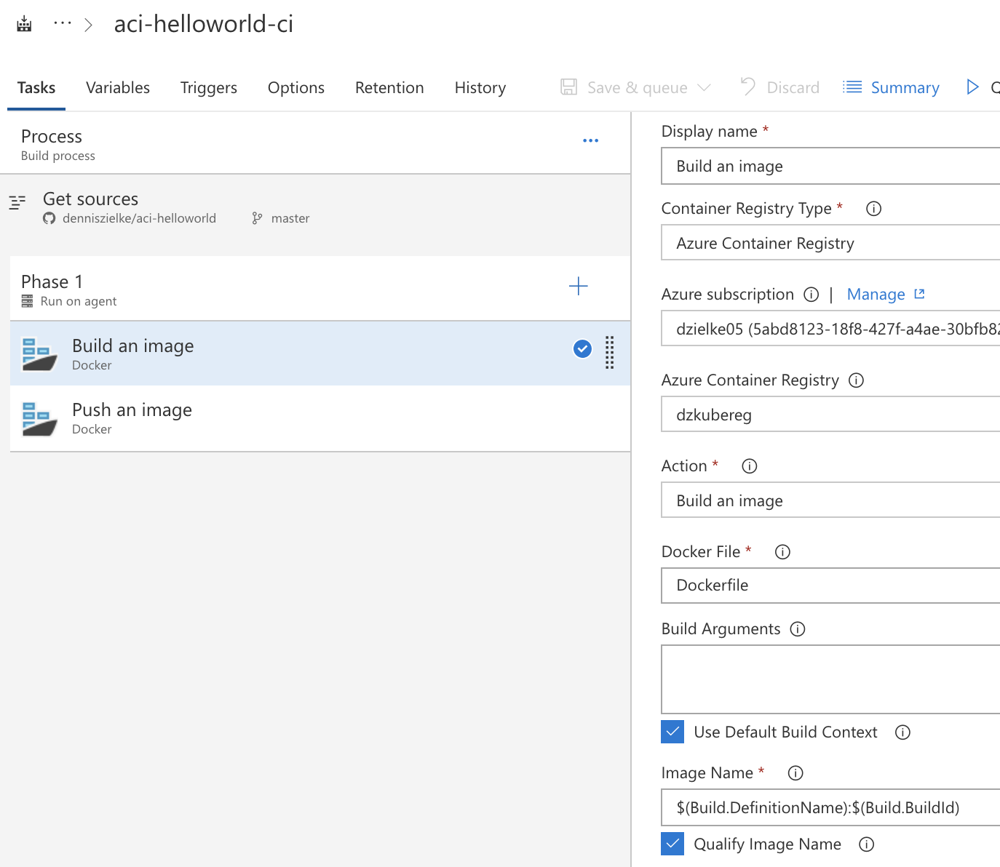
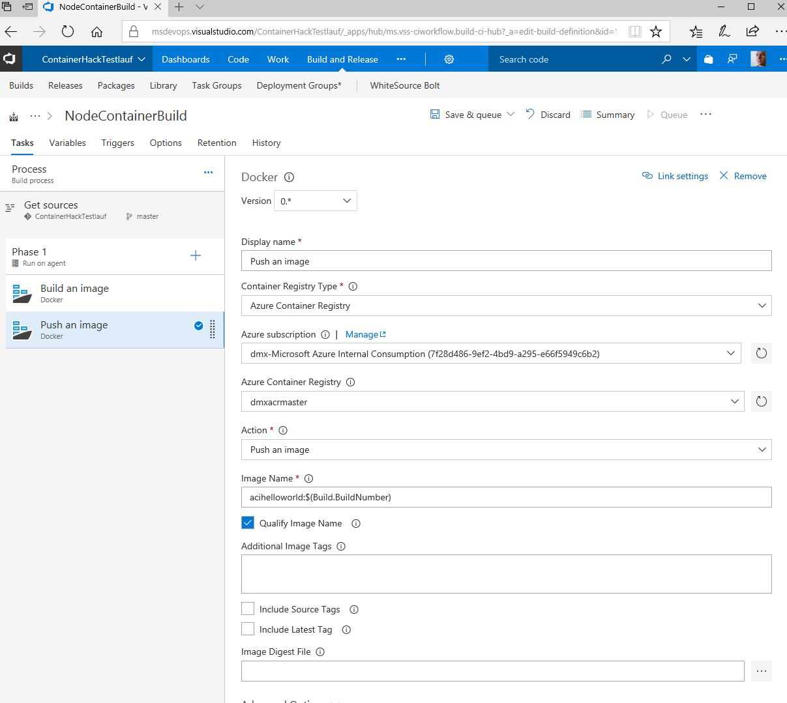

# Automatic creation of containers from source
There are two options

## A. Use azure devops to create a container build pipeline

1. Create a new azure devops project by going on https://dev.azure.com/ 

2. Import the sample code from to your azure devops team project. You can do this via UI in the Repos tab of your team project.


3. Create a new pipeline to build containers and use the **docker container** template.


4. Choose "Hosted Ubuntu 1604" as build agent queue and make sure your pipeline has a propper name.


5. Add the following tasks for your pipeline phase (if you don't find them you can search or install from the marketplace)

> If you have issues with authentication to your azure container registry - you can create use the docker registry type  [here :blue_book:](azuredevops_service_connection.md)!

- Use $(Build.DefinitionName):$(Build.BuildId) to name your image automatically in a format that will allow you find it later. 
- Make sure you reference your Dockerfile correctly
- On the first pipeline you have to authorize your pipeline for your azure subscription.
- Make sure there is always a latest tag on your images

    - "Docker" task to create a container image


    - "Docker" task to push the image
    


6. Start the pipeline and check your container registry for the new image


## B. Use azure container registry tasks (assuming you have a github account)
https://docs.microsoft.com/en-gb/azure/container-registry/container-registry-tutorial-build-task

1. Get a git personal access token (for repo:status and repo:public_repo)
```
ACR_NAME=        # The name of your Azure container registry
GIT_USER=denniszielke      # Your GitHub user account name
GIT_PAT= # The PAT you generated in the previous section
````

2. Create acr task using your azure shell
```
az acr task create \
    --registry $ACR_NAME \
    --name aci-helloworld \
    --image aci-helloworld:{{.Run.ID}} \
    --context https://github.com/$GIT_USER/phoenix.git \
    --branch master \
    --file apps/aci-helloworld/ACR.Dockerfile \
    --git-access-token $GIT_PAT
```

3. Trigger the task
```
az acr task list --registry $ACR_NAME 
az acr task run --registry $ACR_NAME --name aci-helloworld
```

4. Change source code and trigger a build

5. Optionally delete the task
```
az acr task delete --registry $ACR_NAME \
    --name aci-helloworld
```
