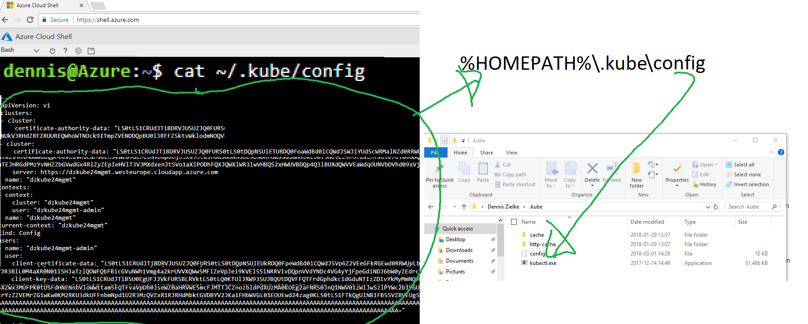

# Create a kubernetes cluster
https://docs.microsoft.com/en-us/azure/aks/kubernetes-walkthrough#create-aks-cluster

**Hint:** The "set KEY value" values commands work in Powershell. In Bash use KEY=value.

1. Use bash to create the resource group by using azure cloud shell (https://shell.azure.com/ )
```
LOCATION=westeurope
KUBE_GROUP=myKubeRG
KUBE_NAME=myFirstKube
az group create -n $KUBE_GROUP -l $LOCATION
```

2. Create the aks cluster using azure shell
```
az aks create --name $KUBE_NAME --resource-group $KUBE_GROUP --node-count 3 --generate-ssh-keys --enable-addons monitoring --kubernetes-version 1.11.4
```
Additional parameters can be found here https://docs.microsoft.com/en-us/cli/azure/aks?view=azure-cli-latest#az_aks_create
if you have to use the given service principal (because you are not allowed to create services principals in azure ad) add the following parameters
```
--client-secret HEREBESECRET --service-principal HEREBEAPPID
```
Customize the vm size with
Look up vm sizes 
```
az vm list-sizes -l westeurope
```
and set as parameter
```
--node-vm-size Standard_B2s
```

3. Export the kubectrl credentials files. 
```
az aks get-credentials --resource-group=$KUBE_GROUP --name=$KUBE_NAME
```

4. Now you can look at the cluster config file under
```
cat ~/.kube/config
```

The following is ** optional** (only for local kubectl)


a. Download the config file from ~/.kube/config to your local disk.
If you are running windows do the following
- Open a cmd.exe windows
- Enter  to move to your user profile directory
```
cd %HOMEPATH%
```
- Create a folder named .kube 
``` 
mkdir .kube
```
- Copy the file named "config" (no extension) to your .kube folder or create the file and copy its contents (look out for line breaks).

If you are running linux create create a folder named ".kube" in your home directory and move the config file there

b. Download kubectl for your plattform
https://kubernetes.io/docs/tasks/tools/install-kubectl/ 

or use this direct link for windows
https://storage.googleapis.com/kubernetes-release/release/v1.12.0/bin/windows/amd64/kubectl.exe

5. Check that everything is running ok
```
kubectl cluster-info
```

6. Launch the dashboard
in the azure shell (look for the url in the output and click on it - you will be directed to the dashboard)
```
az aks browse --resource-group $KUBE_GROUP --name $KUBE_NAME
```

or locally 

```
kubectl proxy
http://localhost:8001/api/v1/namespaces/kube-system/services/kubernetes-dashboard/proxy/#!/pod?namespace=default 
```

7. If you see an access denied - you have to give the dashboard pod permissions first
```
kubectl create clusterrolebinding kubernetes-dashboard \
--clusterrole=cluster-admin \
--serviceaccount=kube-system:kubernetes-dashboard
```