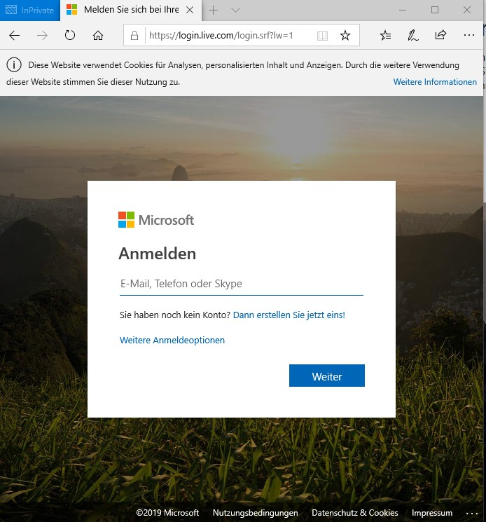
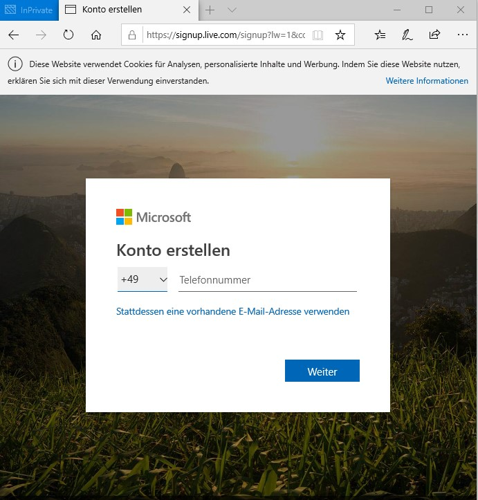
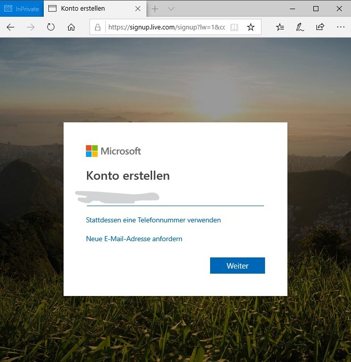
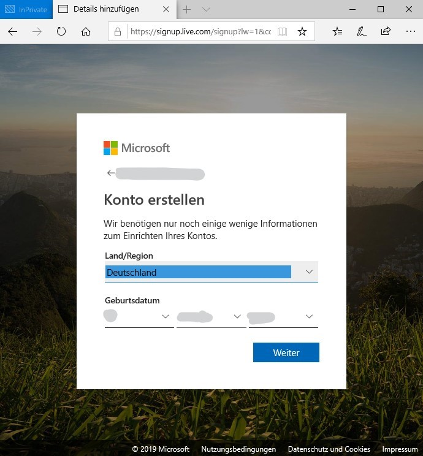
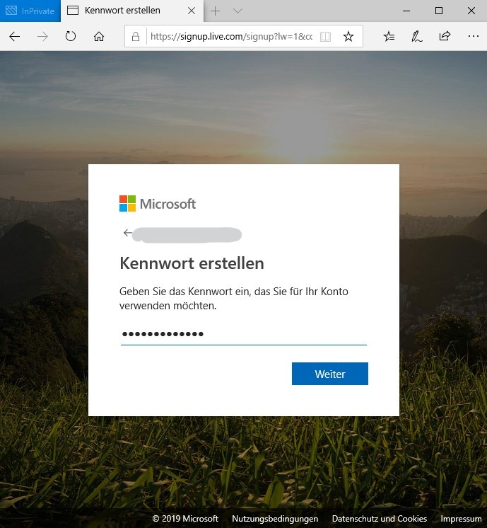
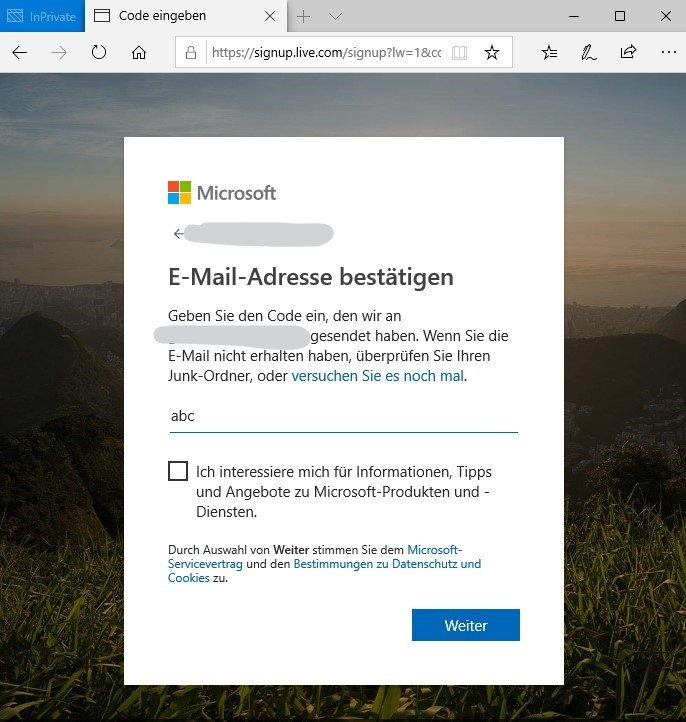

# Setup a Microsoft Account
You need a Microsoft account to use an Azure pass. If you already have one you can take the existing. If not here's how you create a new one.
All you need up front is either a valid mobile number or an existing email address.

1. Go to login.live.com and start the signup process. 

2. Chose to receive your code via phone number or via existing email address

3. Chose country and date of birth

4. Provide a password for your account

5. Provide the code sent to your email address or to your phone number

